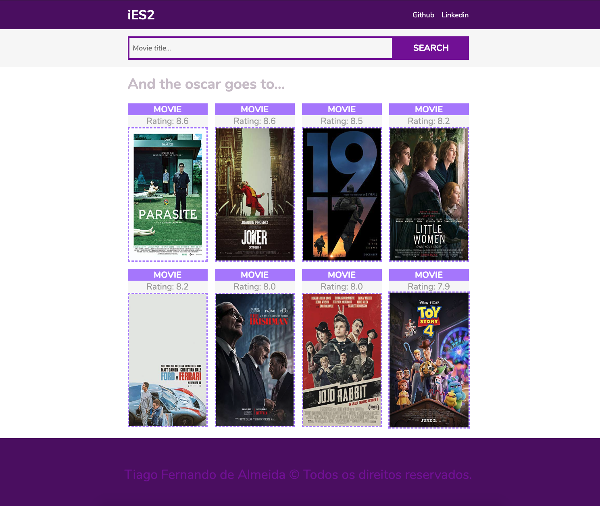

# IES2 - ReactJS App

## Link to access the project: [HERE](https://tiagoalmeida-movie.netlify.com/)

ReactJS / Hooks / Sass / FlexBox (Responsive)

## Screens

Home

## Instructions for running

1 - Install the Dependencies

`yarn or yarn install`

2 - Start the project with

`yarn start`

### Instruções do desafio

Desafio Front-end IES2

Para testar seus conhecimentos no desenvolvimento front-end, estamos te propondo um desafio.

Ele consiste em criar uma aplicação que funcionará como um índice de filmes utilizando uma API do OMDb. Essa aplicação não precisa de um player para transmitir os filmes, apenas mostrar dados como sinopse, categoria, ano, e outros dados que a API fornece. Você está livre para decidir o quê utilizar e como utilizar as tecnologias e bibliotecas necessárias para o desenvolvimento. Entretanto, daremos algumas premissas que você deverá considerar:

1. Fazer um fork do nosso repositório https://github.com/ies2-dev/frontend-test.
2. Utilizando ReactJS, criar uma pequena aplicação que consuma esta API: http://www.omdbapi.com/
3. Deverá conter no mínimo duas páginas, uma listando alguns filmes recomendados com um campo de busca e outra para exibir os detalhes de um filme

Observações e itens opcionais:

1. Seja crítico quanto ao layout, estamos avaliando sua criatividade e como você utiliza as estilizações
2. Faça uma boa separação entre camadas de visualização, negócio e serviços no seu projeto
3. Fazer deploy da aplicação em um serviço de sua preferência
4. Será um diferencial e vamos adorar se voce utilizar testes unitários

Boa sorte Dev !
